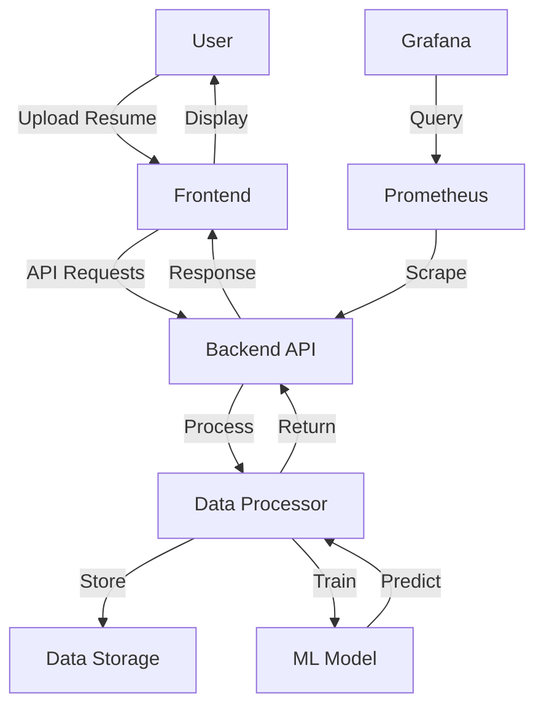
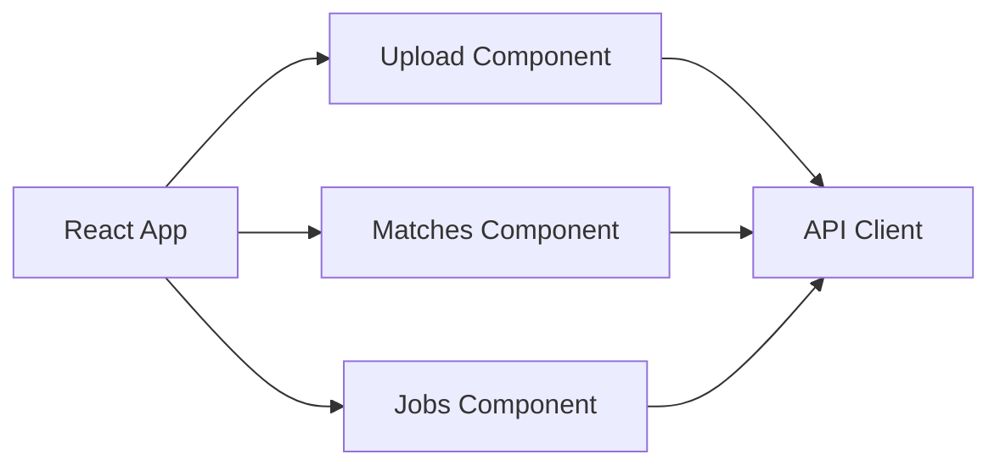
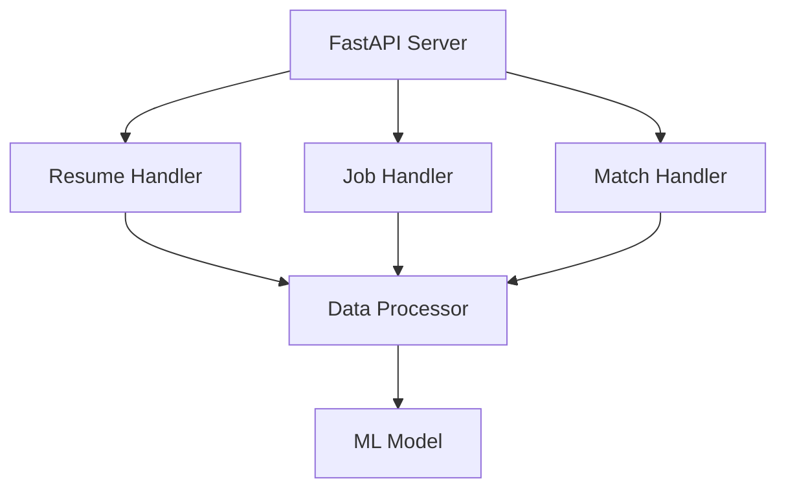
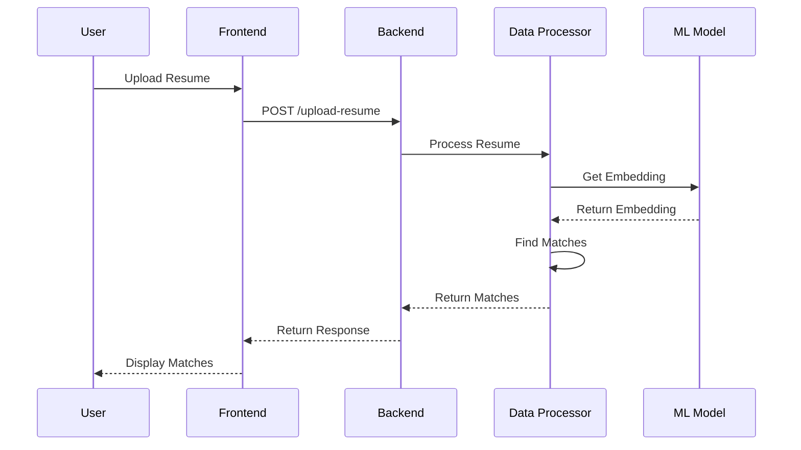
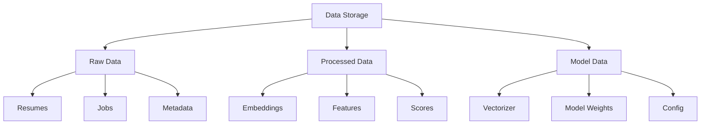
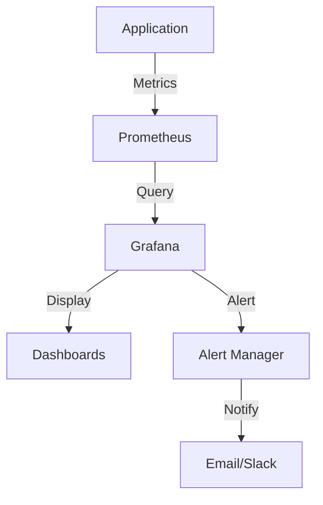
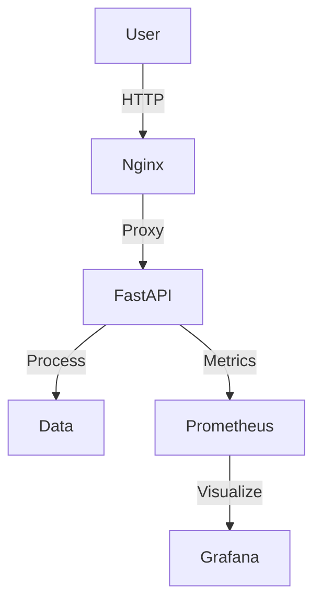
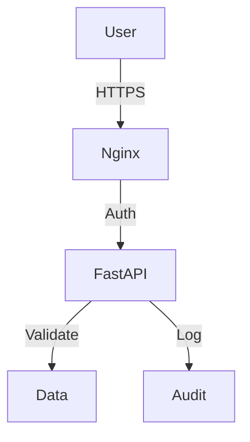
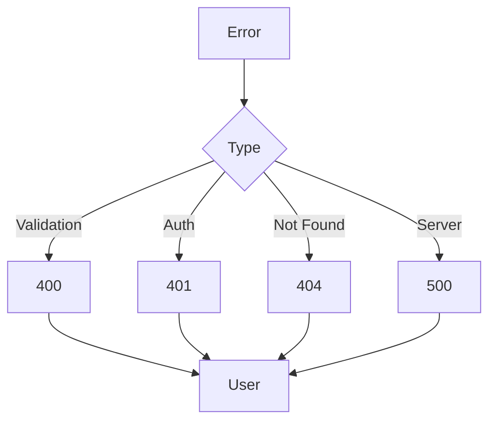

# System Architecture

## High-Level Architecture

## Component Details

### Frontend Layer

### Backend Layer

### Data Flow

## Data Storage Architecture

## Monitoring Architecture

## Deployment Architecture

## Security Architecture

## Error Handling Flow

## Component Interactions

1. **Frontend-Backend**
   - RESTful API communication
   - JSON data exchange
   - File upload handling
   - Real-time updates

2. **Backend-Data**
   - File system operations
   - Data processing
   - Model inference
   - Cache management

3. **Monitoring**
   - Metric collection
   - Performance tracking
   - Error logging
   - Alert management

## Security Measures

1. **API Security**
   - Input validation
   - Rate limiting
   - CORS configuration
   - Error handling

2. **Data Security**
   - File validation
   - Size limits
   - Type checking
   - Sanitization

3. **Monitoring Security**
   - Metric authentication
   - Dashboard access control
   - Alert verification
   - Log protection 